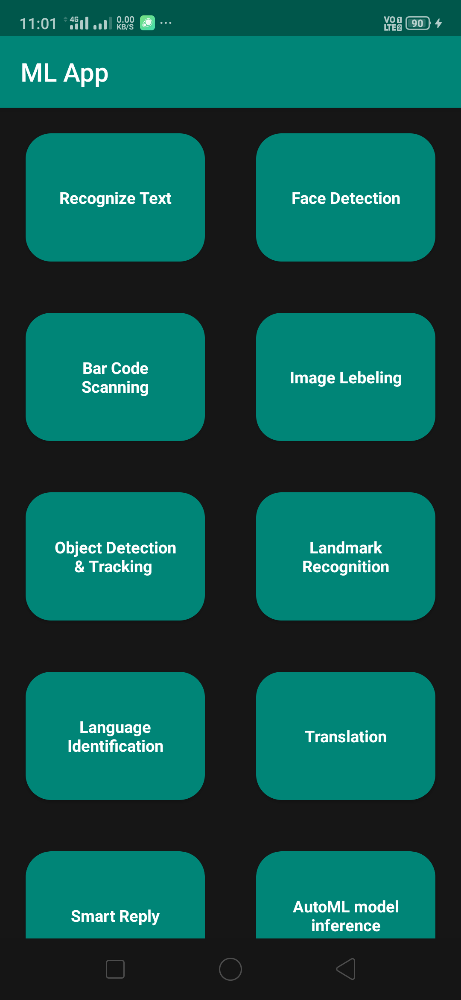
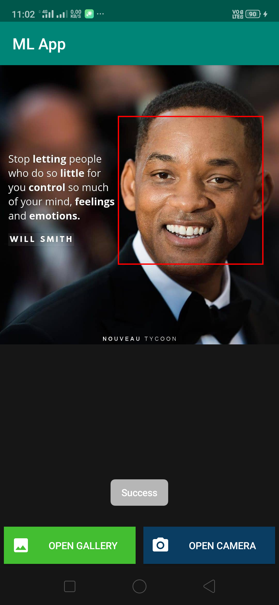
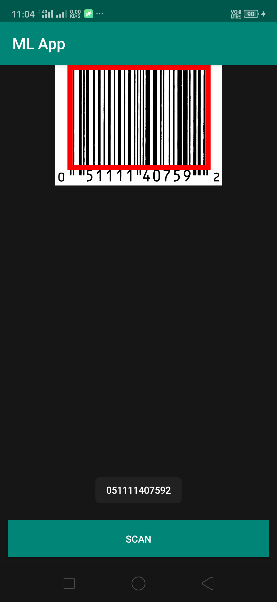
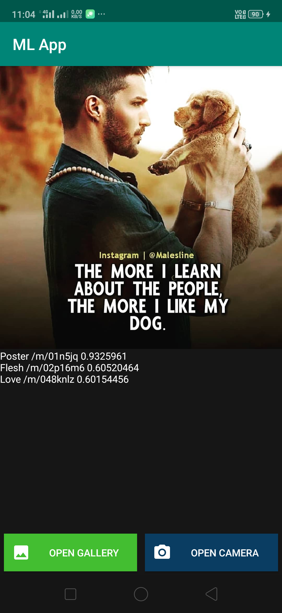

# ML Android App using Firebase ML Kit

This is simple android app built using Firebase ML Kit. It has simple user interface to navigate for various uses of machine learning like face detection, text recognization, bar code scanning and more. You can also apply these features by passing from already saved file in storage. 

## This Android App features.
Text recognition	

Face detection		

Barcode scanning	

Image labeling	

Object detection & tracking	

Landmark recognition		

Language identification		

Translation		

Smart Reply		

AutoML model inference	

Custom model inference

# Screenshots 

## You can download apk file from below mentioned link 
To download apk please visit on link : [Link](https://drive.google.com/file/d/1EaloqE-PmKpglrD7lDDYFs5J51AgatLd/view?usp=sharing)

